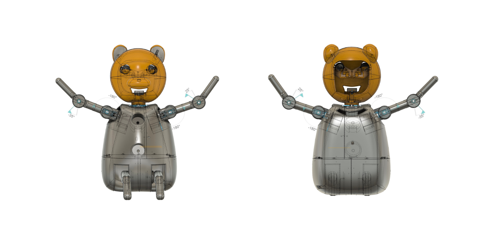
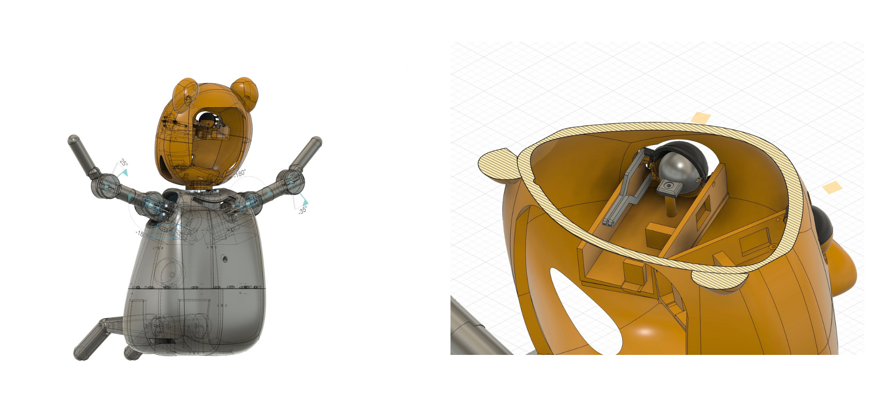
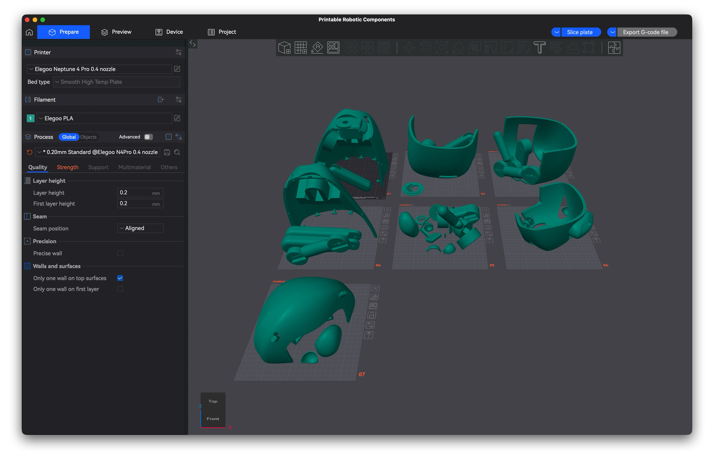

# Qonur 3D Print Pack

This repository contains the **mechanical design package** for Qonur:
- ready-to-print files
- editable Fusion 360 source
- documentation PDFs
- preview images

---

## Preview

### Exterior views (front / back)

### Internal mechanism highlight (eye mechanism view)

### Print pack in slicer (pre-arranged plates)

---

## Files you will use

Open the folder: `3d-files/`

### Print (fastest)
- `3d-files/Printable_Robotic_Components.3mf`  
Open in your slicer and print.

### Edit the design (Fusion 360)
- `3d-files/Editable_Components_Fusion360.f3z`  
Import into Fusion 360, modify parts, then export your own STLs/3MF.

---

## Documentation

Folder: `docs/`

- `docs/Qonur_InfoPack_ENG.pdf`
- `docs/Qonur_Physcial_Design.pdf`

---

## Tested printing setup

- CAD: Autodesk Fusion 360
- Printer: Elegoo Neptune 4 Pro
- Nozzle: 0.4 mm
- Material: PLA recommended

Baseline slicer settings (safe starting point):
- Layer height: 0.2 mm (0.16 mm for smoother finish)
- Walls/perimeters: 3
- Infill: 10–20%
- Supports: only where needed
- Brim: optional for stability on curved parts

---

## Notes about the physical design

The design includes dedicated placeholders/openings:
- Ear area: microphone placeholder
- Back access: cable/charging access
- Chest: LED indicator placeholder
- Chest circular mount: speaker placement area

Assembly can be done with glue or with printed connectors depending on your preferred build approach.

---

## Help

If parts don’t fit or you get printing issues, open a GitHub Issue and include:
- printer + material
- slicer name + key settings
- which file you printed
- photos of the issue
