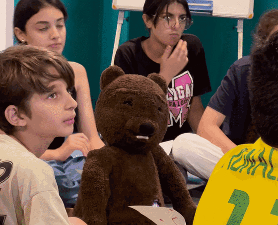
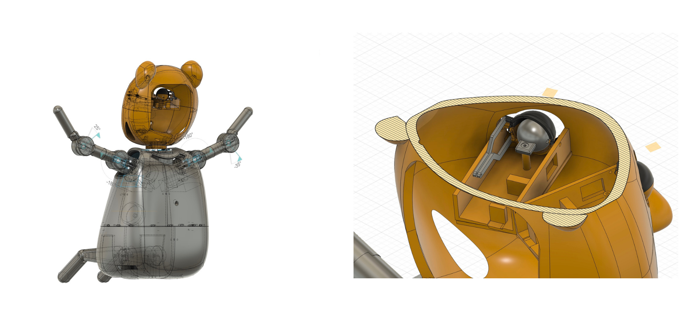

# Qonur: Conversational AI in a 10-Servo Animatronic Bear

[](LICENSE)
[](https://www.youtube.com/watch?v=doGUTJyK8F4)
[](https://fammad.com/work/qonur/)



Qonur is an AI-driven animatronic teddy bear that listens and speaks back in any language, including Azerbaijani. Behind the fur, a cloud language model, a speech pipeline, custom ESP32 firmware, and a 3D-printed actuated body run as one machine, while its mouth, eyes, and arms move in sync with the speech. It is built as a social robot for children, a familiar figure they can safely talk to about hard topics like bullying, or simply have as a friend. It performs in front of children and holds open conversations with them.

The architecture is a hybrid we call a robotic marionette. Gemini handles the conversation (speech in, generated reply, TTS out at 24 kHz) while an operator triggers arm and head gestures from a phone through Blynk. One ESP32 drives ten servos over a PCA9685 plus an 8-LED ring. A Python controller on a Raspberry Pi or laptop records the mic, calls Gemini, plays the reply, and streams mouth positions to the firmware as JSON over USB serial. The body is 3D printable from the pack in `hardware/`, about 40 cm and 2 kg in PLA.

**Watch it perform:** [live performance video](https://www.youtube.com/watch?v=doGUTJyK8F4). Same build, real audience.

## Why a marionette and not full autonomy

A cloud round trip takes several seconds and children do not wait. Scripted scenes need timing a language model will not give you. So the conversation is AI and the choreography stays human, one operator with a phone. We traded away the fully autonomous robot. In exchange, a show never stalls because the API did.

## What we tested

- The full loop on the assembled bear during live performances. Ask a question, the bear replies with moving mouth, blinking eyes, and listening LEDs.
- Two field deployments, one in a children's shelter and one in a rural village in the Lankaran region. Conversations were short-term, and the bear sometimes stayed with the children beyond the performance itself.
- The print pack on an Elegoo Neptune 4 Pro, 0.4 mm nozzle, PLA. 0.2 mm layers, 3 walls, 10 to 20 percent infill, supports only where needed.
- Not yet re-tested after this repo's code fixes: offline boot without WiFi, corrected mouth-sync duration, multi-turn conversation memory, and the inline audio path [PENDING TEST].

## Repository structure

```
main.py                    Python controller (recording, Gemini, TTS, serial)
firmware/qonur_firmware/   ESP32 sketch: servos, LEDs, serial protocol, Blynk
hardware/                  Print pack, Fusion 360 source, wiring, SETUP.md build guide
docs/                      Info pack and physical design PDFs
assets/                    Renders and demo media
```

## Build your own



Body first. [`hardware/SETUP.md`](hardware/SETUP.md) covers printing (tested slicer settings included), what each body opening is for, assembly, and wiring. Print the pre-arranged 3MF or edit the Fusion 360 source and export your own.

Firmware. Open `firmware/qonur_firmware/qonur_firmware.ino` in Arduino IDE, install Adafruit PWM Servo Driver, Adafruit NeoPixel, ArduinoJson, and Blynk, fill in the WiFi and Blynk placeholders (optional), flash.

Controller, on Linux or Raspberry Pi:

```bash
sudo apt-get install -y portaudio19-dev libsndfile1 libasound2-dev
pip install -r requirements.txt
export GEMINI_API_KEY=your_key
python main.py
```

The bear's personality is one text block. Write your own `actor_prompt` in `main.py` and you have your own character, in whatever language and temperament you want. Set `ESP32_PORT` if your board is not on `/dev/ttyUSB0`.

The shipped defaults block content at the strictest Gemini safety thresholds, and in performances the scenario prompt further constrains what the bear says. Conversation memory is session-only and never written to disk.

## Limitations and failure analysis

- Mouth sync is open loop. Animation length comes from the PCM byte count and the pattern is a fixed 10-step sequence, so lips drift from phonemes on long replies.
- Every turn needs internet and Gemini quota. Latency stays at several seconds even with inline audio, long for a young audience.
- Push-to-talk is the Enter key in a terminal. No wake word, no voice activity detection.
- The firmware blinks autonomously every 3 seconds, holding a blocking 100 ms delay and overriding any eye command the controller sent mid-motion.
- Servos run open loop from an assumed 90 degree neutral. Skip mechanical calibration at assembly and every pose is off.
- Conversation memory re-sends recorded audio turns each request and is capped at 10 turn pairs, and the TTS cache rarely hits because replies at temperature 0.8 almost never repeat exactly.

## Future work

Long-term deployment comes first. Both field visits so far were short; the next step is leaving Qonur with a group of children for an extended period and assessing how their willingness to talk and their behaviour change over time. That requires personalization, a bear that remembers each child, which collides directly with children's data privacy. Designing that memory so no child gets profiled in the cloud is the problem we care about most.

On the technical list: a camera and a computer vision model so the bear reacts to who is in front of it, not only to voices, plus lower response latency and more expressive movement, both items that the live shows exposed.

## Status

Qonur was built and performed in 2025, in collaboration with Ritual Theater and Creativity Lab, funded by the Swiss Agency for Development and Cooperation (SDC). This repository merges the original code and mechanical design repositories, with their full history.

## Team

Fuad Mammadov and Jameel Hamzayev built and debugged the hardware and software together. Fuad led the robotics side (mechanics, 3D modeling, portable design), Jamil the AI side. Gülarə Aliyeva did 3D design and assembly, Nadejda Potaenko and Almaz Hasanzada the costume and appearance, Aynur Zarrintaj the script and dramaturgy.

## Credits & contact

Apache-2.0, see LICENSE. Credit appreciated.
Fuad Mammadov, [fammad.com](https://fammad.com) | Jameel Hamzayev, [github.com/jameelhamzayev](https://github.com/jameelhamzayev)
