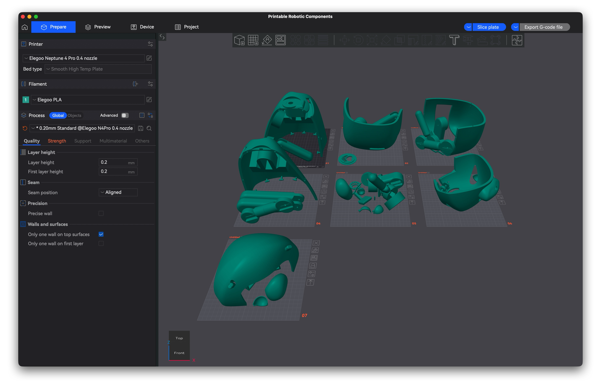

# Building the Qonur body

Everything mechanical lives in this folder. Designed in Autodesk Fusion 360; the finished bear is about 40 cm tall and 2 kg in PLA.

## Files

- `Printable_Robotic_Components.3mf`, plates pre-arranged, open in your slicer and print.
- `Editable_Components_Fusion360.f3z`, full parametric source. Import into Fusion 360, modify parts, export your own STLs or 3MF.
- `pca9685-connection.png`, wiring diagram for the servo driver.

The design PDFs in `../docs/` cover the physical design in detail.

## Tested printing setup

Printed on an Elegoo Neptune 4 Pro with a 0.4 mm nozzle in PLA. Baseline settings that worked:

| Setting | Value |
|---|---|
| Layer height | 0.2 mm (0.16 mm for smoother finish) |
| Walls | 3 |
| Infill | 10 to 20 percent |
| Supports | only where needed |
| Brim | optional, helps on curved parts |

## What the openings are for

The body has dedicated placeholders, so plan the electronics before gluing anything.

- Ear, microphone.
- Chest, LED indicator.
- Chest circular mount, speaker.
- Back, cable and charging access.

## Assembly

Parts join with glue or with the printed connectors, whichever you prefer. The eye and mouth mechanisms are servo-driven; set every servo to 90 degrees before mounting horns, since the firmware assumes 90 as neutral. Skip this and every pose comes out wrong.

## Wiring

Follow `pca9685-connection.png`. ESP32 SDA/SCL to the PCA9685, WS2812 LED data on GPIO4. Servos and LEDs draw from a separate 5 to 6 V supply, common ground with the ESP32. The channel map for all ten servos is in the firmware header.

## If parts do not fit

Open a GitHub issue with your printer and material, slicer name and key settings, which file you printed, and photos of the problem.
